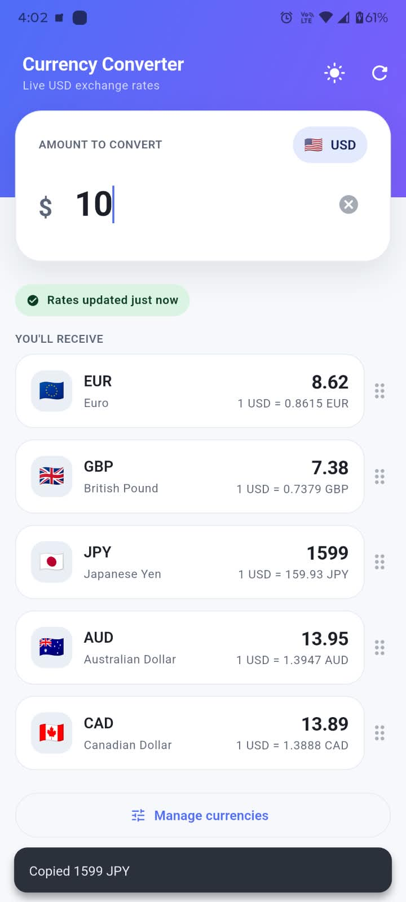
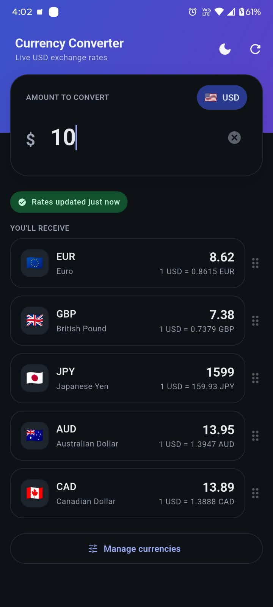
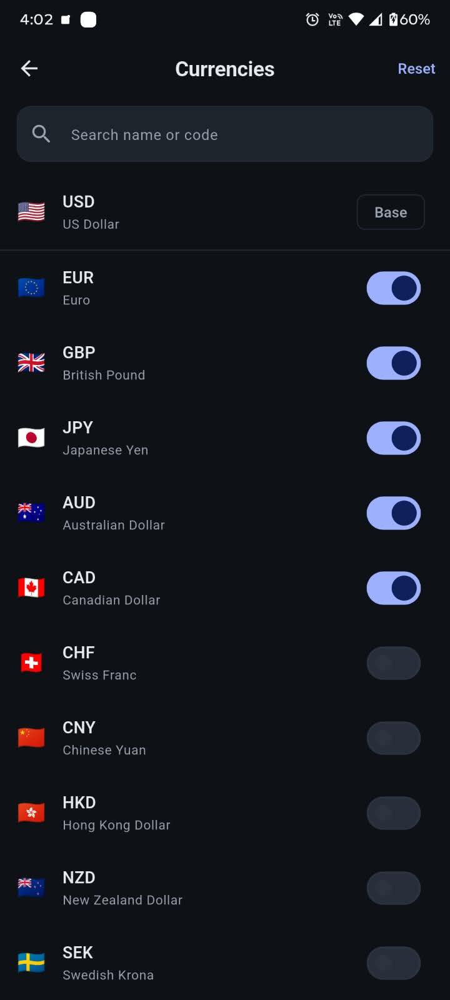
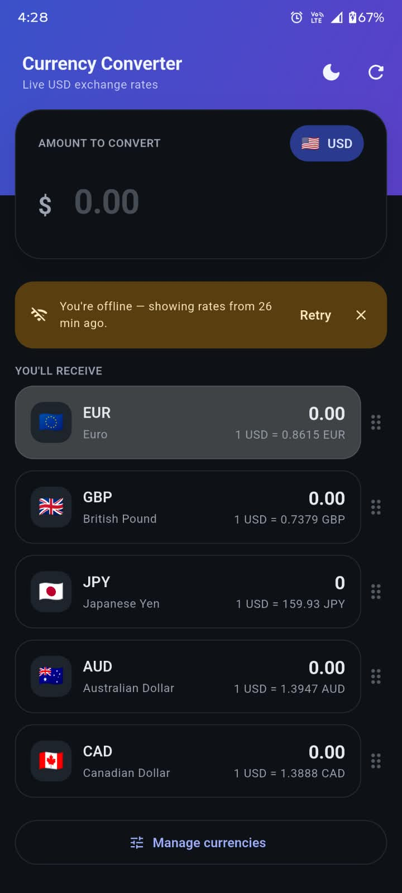
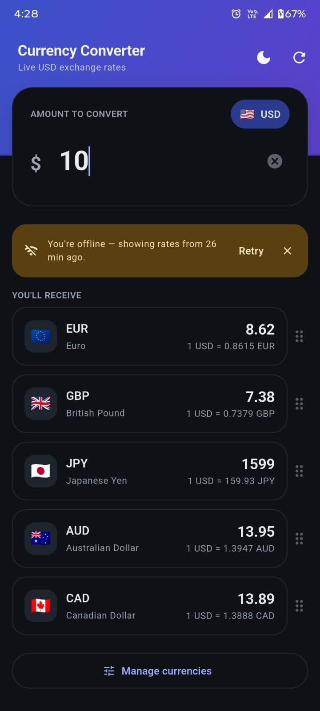

# USD Currency Converter

A small Flutter app: type a USD amount, see it converted to a set of currencies
using real exchange rates, with local caching and explicit handling of network /
API failures. You can pick, search, reorder and reset which currencies show, and
switch light/dark theme — all persisted.

The functional spec this was built from lives in [`agent/`](agent/) — one
markdown file per concern (rules, features, architecture, caching, error
handling, testing, decisions), plus a rendered [`design-system.html`](agent/design-system.html).

## Run it

```bash
flutter pub get
flutter run
```

```bash
flutter test       # 24 tests
flutter analyze    # clean
```

No API key or configuration is needed — the app uses exchangerate-api.com's
key-less `open.er-api.com` endpoint.

## Features

- USD amount → live conversion to a chosen set of currencies (default: EUR, GBP,
  JPY, AUD, CAD), recomputed locally as you type.
- **Manage currencies** screen: add/remove from a ~30-currency catalogue, search
  by code or name, "Reset" to the default five. Changes persist and cost **no
  network call** — every catalogue rate is already fetched and cached.
- **Drag to reorder** the list; order persists.
- **Clear (×)** button on the amount field.
- **Theme toggle** in the header: system → light → dark, persisted.
- 1-hour rate cache, stale-with-banner offline behaviour, typed errors.

## Screenshots

<table>
  <tr>
    <td align="center">
      <br>
      <sub><b>Home — light.</b> $10 converted; tap a row to copy.</sub>
    </td>
    <td align="center">
      <br>
      <sub><b>Home — dark.</b> Same tokens, dark ground.</sub>
    </td>
    <td align="center">
      <br>
      <sub><b>Manage currencies.</b> Search, toggle, reset; USD pinned as base.</sub>
    </td>
  </tr>
  <tr>
    <td align="center">
      <br>
      <sub><b>Offline.</b> Amber banner names the reason and offers Retry.</sub>
    </td>
    <td align="center">
      <br>
      <sub><b>Offline + cache.</b> Cached rates still power the conversion.</sub>
    </td>
    <td></td>
  </tr>
</table>

---

## 1. Walk me through the architecture

Three layers, dependencies point inward (`presentation → domain → data`):

```
lib/
├── main.dart                     composition root: builds the object graph
├── core/
│   ├── constants.dart            currency catalogue + default set, TTL, timeout, URL, storage keys
│   ├── errors.dart               sealed AppException hierarchy
│   ├── formatting.dart           money / rate / "x ago" string helpers
│   └── theme/                    design system: spacing, colour tokens, light+dark ThemeData
├── data/                         everything I/O
│   ├── datasources/
│   │   ├── rates_remote_datasource.dart   HTTP + JSON, maps failures to exceptions
│   │   └── rates_local_datasource.dart    SharedPreferences read/write (rate cache)
│   ├── models/rates_dto.dart     API JSON  ⇄  cache JSON  ⇄  domain entity
│   └── repositories/             one *_impl.dart per domain interface
│       ├── rates_repository_impl.dart                the cache-vs-network policy
│       ├── currency_preferences_repository_impl.dart persisted currency selection
│       └── settings_repository_impl.dart             persisted theme mode
├── domain/                       pure Dart, no Flutter / no http
│   ├── entities/
│   │   ├── exchange_rates.dart              snapshot + fetchedAt + isStale(ttl)
│   │   └── currency_preferences.dart        ordered selection + add/remove/reorder/sanitize
│   ├── repositories/             3 interfaces — the only things presentation depends on
│   └── services/conversion_service.dart     amount × rate
└── presentation/
    ├── controllers/
    │   ├── converter_controller.dart   ChangeNotifier: amount, selection, view state
    │   └── theme_controller.dart       ChangeNotifier: ThemeMode + persistence
    ├── pages/
    │   ├── converter_page.dart         loading / error / ready switch, reorderable list
    │   └── currency_picker_page.dart   add/remove/search currencies
    └── widgets/                        amount input (+clear), row, skeleton, status banner
```

**Why these layers.** The two things being graded — "is the logic testable?"
and "can you swap the API?" — both come from the same split: `domain` defines
the interfaces (`RatesRepository`, `CurrencyPreferencesRepository`,
`SettingsRepository`) and plain entities; `data` implements them. The
repositories and the conversion service are plain Dart, so they unit-test with
no widget harness. Swapping providers means writing one new
`RatesRemoteDataSource`; `domain` and `presentation` don't change.

**Dependency direction is enforced, not aspirational.** `presentation/` imports
only `domain/` interfaces and `core/` — never `data/` (grep-checked). `domain/`
imports neither Flutter nor `http`. `main.dart` is the one place concrete `data`
classes are named, wired by constructor injection (no DI package).

**Why not full Clean Architecture.** No use-case classes, no DI container, no
`Either`/`Result` type. At this size those are boilerplate. Errors are modelled
as a `sealed` exception hierarchy instead of a result type — you still get
exhaustive handling (the `switch` in `converter_page.dart` won't compile if a
case is missed) without wrapping every call site.

**State management.** Two `ChangeNotifier`s — `ConverterController` (amount,
currency selection, view state) and `ThemeController` (theme mode) — injected via
constructor in `main.dart`, each observed by a `ListenableBuilder`. The brief
allows the Provider package; this doesn't need it. All parsing, fetch-timing,
currency mutation and error-to-UI mapping lives in the controllers, never in
widgets.

**Adding currencies** is one entry in `kSupportedCurrencies` + one in
`kCurrencyInfo` in `core/constants.dart`; nothing else hard-codes the list. The
*shown* subset is user-editable and persisted behind `CurrencyPreferencesRepository`
(a second repository following the same shape as `RatesRepository`), stored under
its own SharedPreferences key. The rate fetch keeps the whole catalogue, so
changing the selection never hits the network.

## 2. How does caching work?

- **Store:** a single JSON string under one SharedPreferences key
  (`cached_exchange_rates_v1`) — `{ base, rates, fetchedAt }`. It survives app
  restarts, so a cold launch while offline can still show data.
- **TTL: 1 hour** (`kCacheTtl`). Mid-market FX rates drift a fraction of a
  percent within an hour — invisible for a converter, and 1 h keeps API traffic
  to a handful of calls per session. 24 h risks a visibly wrong rate after a
  volatile day; no cache reintroduces per-launch latency and kills the offline
  story.
- **Read path** (`RatesRepositoryImpl.getRates`):
  1. read the cache;
  2. if it exists and `now - fetchedAt < 1 h` and the caller didn't force a
     refresh → **return it, no network call**;
  3. otherwise fetch → on success **write through** to the cache and return the
     fresh snapshot;
  4. on fetch failure **with** a cached snapshot → return the stale snapshot
     tagged with the error (no throw);
  5. on fetch failure **without** any cache → throw the typed exception.
- **Typing in the amount field never calls this.** The controller keeps the
  rates in memory and re-runs `ConversionService.convert` locally on each
  keystroke, so there is no per-keystroke I/O.
- **Invalidation:** by time (older than the TTL → refresh is attempted first);
  by schema (`_v1` suffix — bump it and old blobs are never read); a blob that
  fails to parse is deleted and treated as a miss.
- **Separate slots.** The currency selection (`currency_selection_v1`) and theme
  mode (`theme_mode_v1`) live under their own keys with their own `_v1`
  versions. Changing one never touches another; the rate cache is only ever
  read/written by `RatesRepositoryImpl`.

## 3. What if there's no internet?

The rule is **show stale data, clearly labelled; only fail hard when there is
nothing to show.**

| Situation | What the user sees |
|---|---|
| Offline, cache present | The rates stay on screen; a dismissible amber banner: *"You're offline — showing rates from 20 min ago."* Pull-to-refresh / the refresh button retry. |
| API returned 500 / garbage, cache present | Same, with copy that blames the service, not the connection. |
| Offline, **no** cache (first run) | Full-screen state: *"No internet connection and no saved rates yet."* + **Retry**. |
| API failing, no cache | Full-screen state: *"The rates service is having problems."* + **Retry**. |

The distinction is carried by the `sealed AppException` type:
`NetworkException` (offline / timeout — recoverable),
`ApiException` (reached the server, response unusable — recoverable, carries the
status code), `CacheMissException` (nothing cached and the fetch failed — not
recoverable without a successful fetch). The remote datasource maps
`SocketException` / `TimeoutException` → `NetworkException` and non-200 /
malformed body → `ApiException`; the repository decides stale-fallback vs
throw; the controller maps the outcome to a view state; the page renders it.

## 4. What did you test, and what did you not?

**Tested** (`flutter test`, 24 cases):

- **`RatesRepositoryImpl`** (`test/data/rates_repository_impl_test.dart`) — the
  headline test. Both datasources are faked with `mocktail`:
  - fresh cache is served and **`remote.fetch()` is never called**
    (`verifyNever`) — delete the freshness check and this test fails;
  - stale cache → fetches and writes through;
  - offline + stale cache → returns the stale data tagged with the error,
    doesn't throw;
  - offline + no cache → rethrows `NetworkException`;
  - `forceRefresh` bypasses a fresh cache; an `ApiException` with a cache falls
    back.
- **`ConversionService`** — the arithmetic, zero/negative amount, empty rates.
- **`HttpRatesRemoteDataSource`** — with a mocked `http.Client`: happy body
  keeps supported-catalogue codes and drops the rest; 500 →
  `ApiException(statusCode: 500)`; `result != "success"` → `ApiException`;
  non-JSON body → `ApiException`; `SocketException` → `NetworkException`.
- **`CurrencyPreferences`** — `withAdded` / `withRemoved` (last-item guard) /
  `reordered` / `sanitized` (drops unknown, duplicate, base; falls back to
  defaults).
- **`CurrencyPreferencesRepositoryImpl`** — real `SharedPreferences` mock:
  empty → defaults; `save`→`load` round-trips a custom order; stale/unknown
  codes are sanitized on load; a corrupt blob → defaults and the key is cleared.

**Not tested, on purpose:**

- **Widget / golden tests** — the UI is deliberately minimal and was still
  moving at the end; pinning it tests nothing durable.
- **The SharedPreferences adapter** for the *rate* cache — a thin wrapper over a
  trusted package; the repository tests fake it. (The *currency* store is tested
  end-to-end because its sanitize-on-load logic is real behaviour, not a passthrough.)
- **The live API** — no network in tests; the datasource tests cover our
  parsing and error mapping against representative payloads.
- **`main.dart` wiring** — constructor calls; a smoke test would assert almost
  nothing.
- **`ThemeController` / `SettingsStore`** — trivial string↔enum mapping over
  SharedPreferences.

## 5. If we needed 50 currencies + real-time updates

- **50 currencies — mostly already done.** The catalogue is one constant, the
  fetch keeps all of it, and which currencies show is a user-editable, ordered,
  persisted list behind `CurrencyPreferencesRepository`. Going to 50 is adding
  entries to `kSupportedCurrencies` + `kCurrencyInfo`; the picker already
  virtualizes with `ListView.builder` + search. Adding one to your list costs
  no network call.
- **Real-time:** drop the TTL to seconds or move to a streaming source
  (websocket / SSE); push updates through the controller instead of fetching on
  demand; show per-rate freshness rather than one global timestamp; reconsider
  `ChangeNotifier` vs an explicit `Stream` on the repository. The layer split
  means this is a `data` + `controller` change, not a rewrite.
- **Editable base currency** was left out on purpose: it needs per-base cache
  keys (`..._v1_<base>`) and a bigger caching story for little user value at
  this scope. Clean next step, not a rewrite.

## 6. Why X over Y

- **`ChangeNotifier` over the Provider package** — two small controllers, each
  one state object; a package would be ceremony. They stay clean, testable seams.
- **A second repository for the currency selection** (over a bare list in the
  controller) — keeps add/remove/reorder/sanitize unit-testable with no widgets
  and mirrors `RatesRepository`, so there's one pattern to learn.
- **Fetch + cache the whole catalogue** (over fetching only the selected set) —
  the payload already carries ~160 currencies, so keeping 30 costs nothing and
  makes "add a currency" instant and offline-safe.
- **Separate storage keys per concern** — a change to the selection or theme can
  never corrupt or invalidate the rate cache.
- **`sealed` exceptions over `Either`/`Result`** — exhaustive handling from the
  compiler without wrapping every call and unwrapping at every use site.
- **Key-less `open.er-api.com` over a keyed provider** — nothing secret to
  manage, `git clone && flutter run` just works. A keyed provider would be one
  new datasource + a `--dart-define`.
- **1-hour TTL over 24 h or none** — see §2.
- **Stale-with-a-banner over hard-fail offline** — a converter is still useful
  with hour-old rates; a blank screen isn't. The banner keeps it honest.
- **`fetchedAt = our fetch time`, not the provider's publish time** — the TTL is
  about "how long since *we* asked", and the free endpoint only publishes daily,
  which would otherwise make every snapshot look stale.

## Design system

`lib/core/theme/` is a small token-based design system, documented in
[`agent/design-system.md`](agent/design-system.md):

- **`app_spacing.dart`** — one 4-point spacing scale and one radius scale;
  widgets use these, not raw numbers.
- **`app_colors.dart`** — an `AppColors` `ThemeExtension` for the semantic
  colours Material's `ColorScheme` doesn't model (success / warning / info
  triads, the header gradient, skeleton shimmer), defined for light **and**
  dark. Accessor: `context.appColors`.
- **`app_theme.dart`** — `AppTheme.light` / `AppTheme.dark`: a hand-built
  `ColorScheme` each (indigo primary, emerald accent), component themes
  (cards, inputs, buttons, banner), and one tuned type scale with tabular
  figures for the numbers.

Default `themeMode` follows the OS; the header toggle overrides it and the
choice persists. No fonts, image assets, or extra packages were added — it's
pure Material 3, and every colour/size comes from `Theme.of(context)`. A
rendered reference of every screen and token is in
[`agent/design-system.html`](agent/design-system.html).

The UI itself: a gradient header (theme toggle + refresh), a floating amount
card with a clear button, flag-badged result cards (tap to copy, drag to
reorder), a "Manage currencies" screen with search, a freshness pill / offline
banner, skeleton rows on first load, and a typed-per-error full-screen error
state.

## Known cuts / what's next

- Error and UI copy are in-code English strings — no localisation.
- The offline banner's "dismissed" flag is per-widget and resets on reason
  change; fine for one screen, wouldn't scale.
- No widget tests (see §4). First addition with more time would be a golden of
  each view state and a `ConverterController` test for the selection mutations.
- The controllers are app-lifetime and never disposed — fine for root
  singletons, would matter if they became route-scoped.
- Editable base currency (see §5).
